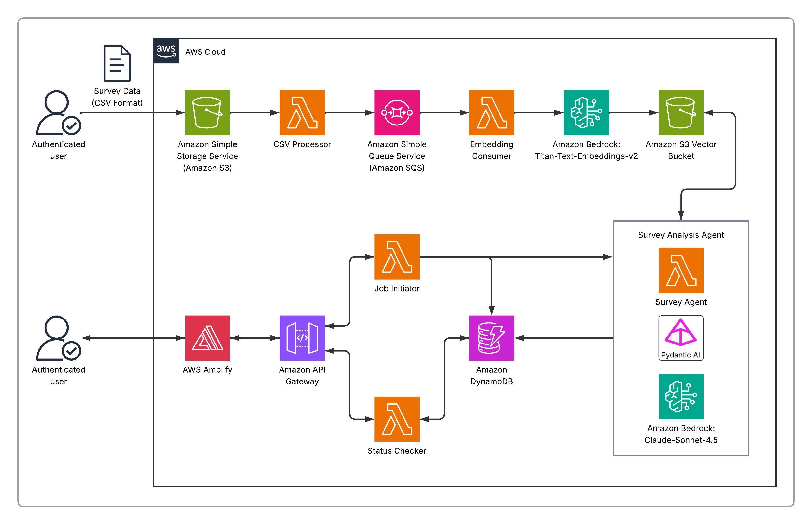

# Survey Analysis Agent

| Index                         | Description                                         |
|:------------------------------|:----------------------------------------------------|
| [Overview](#overview)         | See what this project does and its key capabilities |
| [Demo](#demo)                 | View the demo video                                 |
| [Description](#description)   | Learn about the problem and our approach            |
| [Architecture](#architecture) | View the system architecture diagram                |
| [Tech Stack](#tech-stack)     | Technologies and services used                      |
| [Deployment](#deployment)     | How to install and deploy the solution              |
| [Usage](#usage)               | How to use Survey Analysis Agent                    |
| [Costs](#costs)               | Estimated AWS costs for running the solution        |
| [Credits](#credits)           | Meet the team behind this project                   |
| [License](#license)           | See the project's license information               |
| [Disclaimers](#disclaimers)   | Important legal disclaimers                         |

# Overview

Survey Analysis Agent is an **AI-powered semantic search tool** designed to help organizations extract meaningful
insights from customer survey responses using natural language queries. The solution leverages modern large language
models (LLMs) to understand the context and meaning behind survey responses, enabling users to ask questions in plain
English and receive intelligent, comprehensive analysis.

Key capabilities include:

- **Natural Language Queries**: Ask questions about your survey data in plain English
- **Semantic Search**: Find relevant responses based on meaning, not just keyword matching
- **AI-Powered Analysis**: Get intelligent summaries and insights powered by Claude
- **Downloadable Results**: Export analysis in markdown format and relevant survey results as a CSV

**_While we specifically built this solution for athletics, it is easily adaptable for other use cases. Simply update the
prompt, upload your survey responses, and start querying._**

# Demo

https://github.com/user-attachments/assets/985bb1f0-909f-472e-8356-c8c06e89096f

# Description

## Problem Statement

Organizations collect valuable feedback through customer surveys, but extracting actionable insights from large volumes
of free-text responses presents a significant challenge. Manual analysis is time-consuming, limited in scope, and often
misses important patterns or themes buried in the data. Traditional keyword-based search tools fail to understand the
nuanced meaning and context of survey responses, making it difficult to answer complex questions about customer
sentiment, pain points, or suggestions.

## Our Approach

Survey Analysis Agent addresses these challenges through an intelligent semantic search platform that combines vector
embeddings with AI-powered analysis.

**Semantic Search Pipeline**: Survey responses are processed through Amazon Titan embeddings and stored in S3 Vectors,
enabling similarity-based retrieval that understands context and meaning rather than relying on exact keyword matches.
When users submit queries, the system finds the most relevant responses based on semantic similarity.

**AI Agent Architecture**: At the core of the system is an AI agent powered by Claude Sonnet 4.5 via Amazon Bedrock,
built using the pydantic-ai framework. The agent can rewrite user queries for optimal search results, perform semantic
searches across the survey corpus, and synthesize findings into clear, actionable insights.

**Serverless Architecture**: The platform leverages a fully serverless architecture built on AWS services including
Lambda, API Gateway, S3, DynamoDB, and Cognito. Queries are processed asynchronously—users submit a query, receive a job
ID, and poll for results—enabling longer-running AI analysis without API timeout constraints. This provides automatic
scaling, eliminates server management overhead, and ensures cost-efficient operation.

**Modern User Interface**: The React-based web interface provides a clean, intuitive experience for submitting queries
and viewing AI-generated analysis with full markdown rendering support.

## Embedding Testing & Validation

During preliminary testing of our semantic similarity search, we evaluated the quality of embedding results using
various keyword queries. Through this testing, we found that relevant results consistently scored above a 0.15
similarity threshold, which we established as our cutoff for filtering search results.


# Architecture



# Tech Stack

| Category                      | Technology                                                       | Purpose                                          |
|:------------------------------|:-----------------------------------------------------------------|:-------------------------------------------------|
| **Amazon Web Services (AWS)** | [AWS CDK](https://docs.aws.amazon.com/cdk/)                      | Infrastructure as code for deployment            |
|                               | [Amazon Bedrock](https://aws.amazon.com/bedrock/)                | Access to Claude Sonnet 4.5 and Titan embeddings |
|                               | [AWS Lambda](https://aws.amazon.com/lambda/)                     | Serverless compute for agent and data processing |
|                               | [Amazon S3 Vectors](https://aws.amazon.com/s3/features/vectors/) | Vector database for semantic search embeddings   |
|                               | [Amazon S3](https://aws.amazon.com/s3/)                          | Storage for uploaded survey data                 |
|                               | [Amazon API Gateway](https://aws.amazon.com/api-gateway/)        | REST API endpoint with Cognito authorization     |
|                               | [Amazon Cognito](https://aws.amazon.com/cognito/)                | User authentication and authorization            |
|                               | [AWS Amplify](https://aws.amazon.com/amplify/)                   | Frontend hosting and deployment                  |
|                               | [Amazon SQS](https://aws.amazon.com/sqs/)                        | Message queuing for embedding processing         |
|                               | [Amazon DynamoDB](https://aws.amazon.com/dynamodb/)              | Async job tracking and status storage            |
| **Backend**                   | [Python 3.13](https://www.python.org/)                           | Lambda runtime                                   |
|                               | [pydantic-ai](https://ai.pydantic.dev/)                          | AI agent framework with tool calling support     |
|                               | [boto3](https://aws.amazon.com/sdk-for-python/)                  | AWS SDK for Python                               |
|                               | [pandas](https://pandas.pydata.org/)                             | Data processing for CSV uploads                  |
| **Frontend**                  | [React 19](https://react.dev/)                                   | UI framework                                     |
|                               | [Vite](https://vite.dev/)                                        | Build tool and development server                |
|                               | [TypeScript](https://www.typescriptlang.org/)                    | Type-safe JavaScript                             |
|                               | [Tailwind CSS](https://tailwindcss.com/)                         | Utility-first CSS framework                      |
|                               | [AWS Amplify SDK](https://docs.amplify.aws/)                     | Authentication integration                       |

# Deployment

## Prerequisites

Before deploying Survey Analysis Agent, ensure you have the following prerequisites in place:

1. Sign up for an [AWS account](https://signin.aws.amazon.com/signup?request_type=register) if you haven't already
2. **Node.js** (v18 or later) - [Download here](https://nodejs.org/en/download) or
   use [nvm](https://github.com/nvm-sh/nvm)
3. **AWS CDK** (v2) - Install via npm:
   ```bash
   npm install -g aws-cdk
   ```
4. **AWS CLI** - [Installation Guide](https://docs.aws.amazon.com/cli/latest/userguide/getting-started-install.html)
5. **Docker** - [Download here](https://www.docker.com/get-started/)
6. **Git** - [Download here](https://git-scm.com/)

## AWS Configuration

1. **Configure AWS CLI with your credentials**:
   ```bash
   aws configure
   ```
   Provide your AWS Access Key ID, Secret Access Key, and region (e.g., `us-east-1`) when prompted.

2. **Bootstrap your AWS environment for CDK** _(required only once per AWS account/region)_:
   ```bash
   cdk bootstrap aws://ACCOUNT_ID/REGION
   ```
   Replace `ACCOUNT_ID` and `REGION` with your AWS account ID and region.

## Quick Start (Recommended)

1. **Clone the repository**:
   ```bash
   git clone https://github.com/pitt-cic/survey-analysis-agent.git
   cd survey-analysis-agent
   ```

2. **Run the deploy script (`deploy.sh`)**:
   ```bash
   chmod +x ./deploy.sh
   ./deploy.sh
   ```

3. **Select option 1** to deploy infrastructure and frontend.

The script provides a menu-driven interface for:
- Deploying infrastructure and frontend
- Viewing deployment details (URLs, User Pool ID, etc.)
- Uploading survey data with CSV validation
- Inviting users via Cognito

<details>
<summary><strong>Manual Deployment Steps</strong></summary>

### Backend Deployment

1. **Clone the repository and navigate to the project directory**:
   ```bash
   git clone https://github.com/pitt-cic/survey-analysis-agent.git
   cd survey-analysis-agent
   ```

2. **Install dependencies and deploy the infrastructure using CDK**:
   ```bash
   cd infrastructure
   npm install
   npx cdk deploy
   ```

   The deployment will create all necessary AWS resources and output the configuration values needed for the frontend.

### Frontend Deployment

**Ensure the backend is fully deployed before proceeding.**

Run the deployment script from the frontend directory:

```bash
cd frontend
chmod +x ./deploy-frontend.sh
./deploy-frontend.sh
```

The script will:

- Automatically pull CDK outputs from the backend deployment
- Generate the required environment variables
- Build the React application
- Deploy to AWS Amplify

</details>

## Local Development

For local frontend development:

```bash
cd frontend
npm install
npm run dev
```

The terminal will display the local URL where the development server is running.

---

# Usage

1. **Access the Application**:

   Once deployed, access the web interface using the Amplify URL. Run the deploy script (`./deploy.sh`) and select option 2 (Describe Deployment) to view your application URL and other deployment details.

2. **User Registration**:

   User accounts are managed by administrators in Amazon Cognito. Users only need to be added by email—they will
   provide their name and set their password on first login.

   **Via deploy.sh (Recommended):**
   Run `./deploy.sh` and select option 4 (Invite User). The script will prompt for the user's email and handle the rest.

   <details>
   <summary>Manual Methods</summary>

   **Via AWS CLI:**
   ```bash
   aws cognito-idp admin-create-user \
     --user-pool-id <USER_POOL_ID> \
     --username "user@example.com" \
     --user-attributes Name=email,Value=user@example.com Name=email_verified,Value=true \
     --desired-delivery-mediums EMAIL
   ```
   Replace `<USER_POOL_ID>` with the value from your CDK deployment outputs.

   **Via AWS Console:**
   Navigate to Amazon Cognito > User pools > `survey-analysis-users` > Users > Create user.
   [Learn more about creating Cognito users](https://docs.aws.amazon.com/cognito/latest/developerguide/how-to-create-user-accounts.html).

   </details>

3. **Login**:

   Log in using your email and the temporary password sent to your inbox. On first login, you'll be prompted to set a
   new password and provide your name.

4. **Upload Survey Data**:

   Upload your survey responses as a CSV file to the S3 data bucket. The system will
   automatically process the data and generate embeddings for semantic search.

   **Via deploy.sh (Recommended):**
   Run `./deploy.sh` and select option 3 (Upload Survey Data). The script will validate your CSV columns before uploading.

   <details>
   <summary>Manual Methods</summary>

   **Via AWS CLI:**
   ```bash
   aws s3 cp your-survey-data.csv s3://survey-agent-data/input/
   ```

   **Via AWS Console:**
   Navigate to Amazon S3 > `survey-agent-data` > `input/` folder > Upload.

   </details>

   &nbsp;

   **CSV Format Requirements:**

   Our survey data contained a mix of text and multiple choice responses, so we only embed rows where `QUESTION_TYPE`
   equals "Text" and `TEXT_ANSWER` is non-empty. If your data structure differs, you can modify the filtering logic,
   required columns, and metadata columns in [
   `backend/core/services/embeddings_service.py`](backend/core/services/embeddings_service.py).

   **Required Columns:**
   | Column | Description |
   |:-------|:------------|
   | `TEXT_ANSWER` | The survey response text (only non-empty rows are processed) |
   | `QUESTION_TYPE` | Must be "Text" for rows to be embedded |

   **Metadata Columns** (stored with embeddings for filtering and display):
   | Column | Description |
   |:-------|:------------|
   | `QUESTION` | The survey question text |
   | `EVENTNAME` | Event name |
   | `EVENTCODE` | Event code |
   | `NPS_GROUP` | NPS classification (Promoter, Passive, Detractor) |
   | `RESPONSEID` | Unique response identifier |

5. **Query Your Data**:

   Enter natural language questions about your survey data. Examples:
    - "What are the most common complaints?"
    - "How do customers feel about our pricing?"
    - "What features are customers requesting?"

6. **View and Export Results**:

   The AI agent will analyze relevant survey responses and provide a comprehensive summary. Analysis can be downloaded
   in markdown format, and relevant survey results can be downloaded as a CSV.

# Costs

The following cost estimates are based on AWS pricing as of February 2026. Actual costs may vary based on usage patterns
and AWS pricing changes.

## Estimated Monthly Recurring Costs

| Service            |   Estimated Cost | Notes                                     |
|:-------------------|-----------------:|:------------------------------------------|
| AWS Amplify        |              ~$0 | Free tier covers most small deployments   |
| Amazon Cognito     |              ~$0 | Free tier covers first 10,000 MAUs        |
| Amazon S3          |              <$1 | Storage for CSV uploads (minimal)         |
| Amazon S3 Vectors  |              <$5 | Vector storage (depends on dataset size)  |
| Amazon DynamoDB    |              <$1 | Pay-per-request, minimal for job tracking |
| Amazon API Gateway |              <$1 | Based on request volume                   |
| AWS Lambda         |              <$1 | Based on invocation count and duration    |
| **Total Baseline** | **~$5-10/month** | Excluding Bedrock usage                   |

## Per-Query Costs (Amazon Bedrock)

Each query to the AI agent incurs Bedrock costs based on token usage:

| Model                      |          Usage |       Cost |
|:---------------------------|---------------:|-----------:|
| Claude Sonnet 4.5 (input)  | ~30,000 tokens |     ~$0.09 |
| Claude Sonnet 4.5 (output) |  ~1,250 tokens |     ~$0.02 |
| **Total per query**        |                | **~$0.11** |

**Example monthly costs by usage:**

- 100 queries/month: ~$11 in Bedrock costs
- 500 queries/month: ~$55 in Bedrock costs
- 1,000 queries/month: ~$110 in Bedrock costs

## One-Time Embedding Costs

When uploading survey data, embeddings are generated using Amazon Titan:

| Model                    |               Cost |
|:-------------------------|-------------------:|
| Titan Text Embeddings v2 | $0.00002/1K tokens |

For a dataset of 10,000 survey responses (~500K tokens), embedding costs would be approximately $0.01.

# Credits

**Survey Analysis Agent** is an open-source project developed by the University of Pittsburgh Health Sciences and Sports
Analytics Cloud Innovation Center.

**Development Team:**

- [Varun Shelke](https://www.linkedin.com/in/vashelke/)
- [Gary Farrell](https://www.linkedin.com/in/gary-farrell/)

**Project Leadership:**

- **Technical Lead**: [Maciej Zukowski](https://www.linkedin.com/in/maciejzukowski/) - Solutions Architect, Amazon Web
  Services (AWS)
- **Program Manager**: [Kate Ulreich](https://www.linkedin.com/in/kate-ulreich-0a8902134/) - Program Leader, University
  of Pittsburgh Health Sciences and Sports Analytics Cloud Innovation Center

**Special Thanks:**

- [Richard Turnquist](https://www.linkedin.com/in/richardturnquist/) - Associate Athletic Director, Data and Analytics Strategy,
  Pitt Athletics

This project is designed and developed with guidance and support from
the [Health Sciences and Sports Analytics Cloud Innovation Center, powered by AWS](https://digital.pitt.edu/cic).

# License

This project is licensed under the [MIT License](./LICENSE).

```plaintext
MIT License

Copyright (c) 2025 University of Pittsburgh Health Sciences and Sports Analytics Cloud Innovation Center

Permission is hereby granted, free of charge, to any person obtaining a copy
of this software and associated documentation files (the "Software"), to deal
in the Software without restriction, including without limitation the rights
to use, copy, modify, merge, publish, distribute, sublicense, and/or sell
copies of the Software, and to permit persons to whom the Software is
furnished to do so, subject to the following conditions:

The above copyright notice and this permission notice shall be included in all
copies or substantial portions of the Software.

THE SOFTWARE IS PROVIDED "AS IS", WITHOUT WARRANTY OF ANY KIND, EXPRESS OR
IMPLIED, INCLUDING BUT NOT LIMITED TO THE WARRANTIES OF MERCHANTABILITY,
FITNESS FOR A PARTICULAR PURPOSE AND NONINFRINGEMENT. IN NO EVENT SHALL THE
AUTHORS OR COPYRIGHT HOLDERS BE LIABLE FOR ANY CLAIM, DAMAGES OR OTHER
LIABILITY, WHETHER IN AN ACTION OF CONTRACT, TORT OR OTHERWISE, ARISING FROM,
OUT OF OR IN CONNECTION WITH THE SOFTWARE OR THE USE OR OTHER DEALINGS IN THE
SOFTWARE.
```

---

For questions, issues, or contributions, please visit
our [GitHub repository](https://github.com/pitt-cic/survey-analysis-agent) or contact the development team.

## Disclaimers  
**Customers are responsible for making their own independent assessment of the information in this document.**  
**This document:**  
(a) is for informational purposes only,  
(b) references AWS product offerings and practices, which are subject to change without notice,  
(c) does not create any commitments or assurances from AWS and its affiliates, suppliers or licensors. AWS products or
services are provided "as is" without warranties, representations, or conditions of any kind, whether express or
implied. The responsibilities and liabilities of AWS to its customers are controlled by AWS agreements, and this
document is not part of, nor does it modify, any agreement between AWS and its customers, and  
(d) is not to be considered a recommendation or viewpoint of AWS.

**Additionally, you are solely responsible for testing, security and optimizing all code and assets on GitHub repo, and
all such code and assets should be considered:**  
(a) as-is and without warranties or representations of any kind,  
(b) not suitable for production environments, or on production or other critical data, and  
(c) to include shortcuts in order to support rapid prototyping such as, but not limited to, relaxed authentication and
authorization and a lack of strict adherence to security best practices.  
**All work produced is open source. More information can be found in the GitHub repo.**
